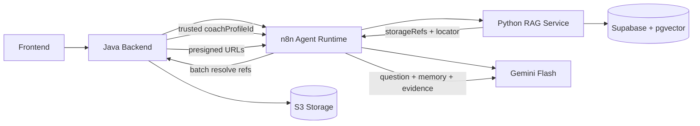

## System Architecture Flow

### Rollen

- Java: Tenancy/Auth/Policies/Presigned URLs/Status.
- n8n: Chat, Memory, Tool-Calling, LLM-Orchestrierung.
- Python: Preprocessing, Indexing, Retrieval.
- Supabase: Vektoren + Evidence-Metadaten.
