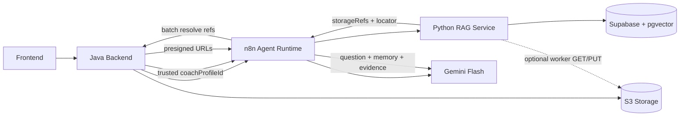

## Flow: Gesamtarchitektur (Java + n8n + Python RAG)

Dieses Dokument erklärt die übergreifende Architektur, damit zukünftige Änderungen klar einer Schicht zugeordnet werden können.

---

## Kurzüberblick

- **Java Backend** ist Source of Truth für Auth, Tenancy (`coachProfileId`), Storage-Policies und Status.
- **n8n** ist Chat-Orchestrator (Memory, Tool Calling, Agent-Entscheidung, LLM-Aufruf).
- **Python RAG Service** macht Indexing und Retrieval (Proof-first, Evidence ohne presigned URLs).
- **Supabase** speichert Quellen und Chunks in `rag_sources` und `rag_chunks`.
- **S3** hält Originalmedien und Derivate (z. B. PDF-Seitenbilder).
- **Python ↔ S3 (optional, Worker-Zugang)** kann Originale per **Worker-Credentials** laden (`GET`) und PDF-Derivate wie **gerenderte Seitenbilder** hochladen (`PUT`), wenn `RAG_S3_*` konfiguriert ist (`object_storage.py`). Das ist **nicht** dasselbe wie die **Presigned-URLs für Flash/n8n** beim Chat (die weiterhin über Java Resolve laufen).

---

## 1. Verantwortlichkeiten (warum diese Trennung)

### Java Backend

- Setzt den vertrauenswürdigen Kontext (`coachProfileId`) aus DB/Session.
- Erzwingt Zugriff auf Media-Objekte per Policy und stellt presigned URLs aus.
- Führt Statusmaschinen für Uploads/Jobs.
- Ist der Ort für Quotas, Billing-nahe Regeln und Audit.

### n8n

- Empfängt den Chat-Request in einem agentischen Workflow.
- Ruft Python-Tools auf (`retrieve`, optional `prepare-context`).
- Ruft Java Batch-Resolve auf.
- Baut finalen Prompt/Attachment-Context für Gemini Flash.

### Python RAG Service

- Indexiert Text/PDF/Video/Audio in Vektor- und Evidence-Form.
- Video ist Transcript-first (`video_span`) statt multimodaler Video-Window-Embeddings.
- Führt semantisches Retrieval tenant-sicher aus.
- Liefert strukturierte Evidences (`storageRefs`, `locator`, `labels`, `hintForLLM`).
- Kann bei konfiguriertem Worker-Object-Storage **direkt auf S3** zugreifen: Download des Originals zu Indexing-Zeit, optional Upload gerenderter PDF-Seiten (`content_loader.py`, `object_storage.py`).

---

## 2. Datenfluss auf hoher Ebene

---

## 3. Kritische Architekturregeln

- Python liefert **niemals** dauerhafte öffentliche URLs an Clients, nur `storageRefs` (für Resolve durch Java).
- **Chat/Flash**: Kurzlebige **Presigned-URLs** für Medien an das LLM kommen weiterhin **nur über Java Batch-Resolve** (Tenancy/Policy).
- **Indexing-Worker**: Separater Zugang über `RAG_S3_*` nur für definierte Buckets/Key-Prefixe; kein Ersatz für den Chat-Resolve-Pfad.
- n8n ruft Java Resolve im **Batch** auf (kein N+1 pro Evidence).
- Tenancy ist immer serverseitig: `coachProfileId` aus Java-Kontext, nie aus Usertext.
- Antwortmodus ist Proof-first: Antwort in eigenen Worten + IEEE-Quellenliste.

---

## 4. Fehler- und Recovery-Pfade

- Wenn Python Retrieval fehlschlägt: n8n gibt kontrollierte Fehlermeldung zurück; kein stilles Halluzinieren.
- Wenn Java Resolve einzelne Refs verweigert: nur verfügbare Refs an LLM geben, verweigerte in Debug/Audit markieren.
- Wenn LLM-Aufruf scheitert: Chat-Request als transient error klassifizieren; Retry-Policy über n8n.

---

## Relevante Dateien

| Bereich | Datei |
|---|---|
| Python API | `services/rag_service/src/rag_service/main.py` |
| Python Orchestrierung | `services/rag_service/src/rag_service/service.py` |
| Python Schema | `services/rag_service/schema.sql` |
| Flows-Spezifikation | `docs/building/plan_initial_overview.md` |
