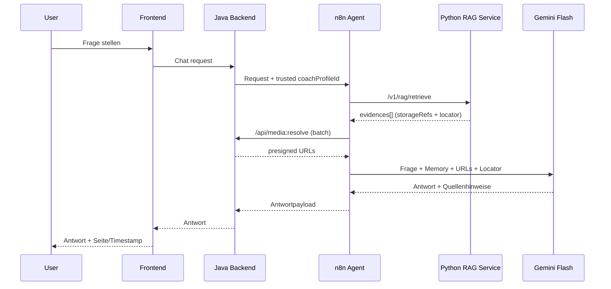

## Chat Answering Flow (2-Call Pattern)

### Kernregeln

- n8n ruft genau 2 Tools auf: `retrieve` und `resolve-media-refs`.
- Python liefert niemals dauerhafte URLs, nur `storageRefs`.
- Java bleibt Owner für URL-Resolution und Tenancy-Checks.
