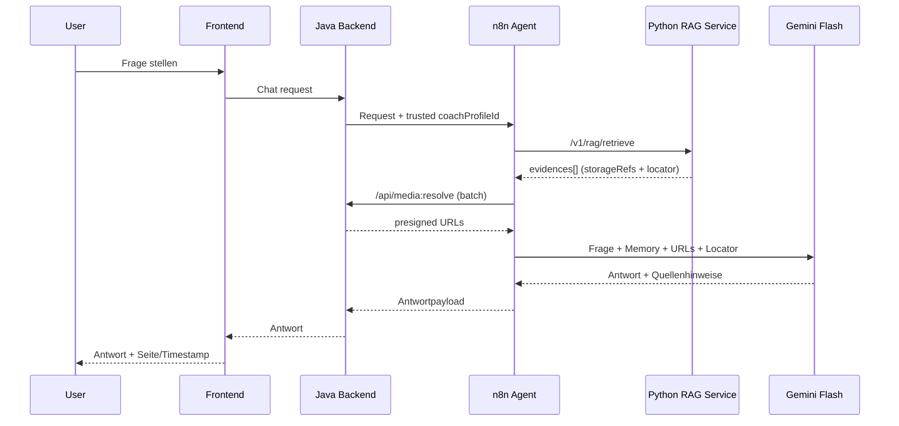

## Flow: Chat Answering (2-Call Pattern)

Dieses Dokument beschreibt den Runtime-Ablauf für eine Userfrage im Coach-Chat.

---

## Kurzüberblick

- Java liefert den vertrauenswürdigen Tenant-Kontext (`coachProfileId`) in den n8n-Workflow.
- n8n ruft **Python retrieve** auf und erhält Evidence-Pakete ohne URLs.
- n8n ruft **Java resolve-media-refs** im Batch auf und erhält kurzlebige presigned URLs.
- n8n ruft Gemini Flash mit Frage, Memory und Evidence-Context auf.
- Antwort kommt als Paraphrase plus IEEE-Quellenliste zurück (`[1] PDF ... Seite X`, `[2] Video ... Minute mm:ss`).

*(Separat: Im **Indexing-Job** kann Python optional mit Worker-S3 Originale laden — das ändert nichts daran, dass im Chat **nur Java** Presigned-URLs für Evidence-Medien liefert.)*

---

## 1. Schrittfolge im Detail

1) User stellt Frage im Frontend.
2) Frontend sendet an Java Chat-Endpoint.
3) Java validiert User, bestimmt `coachProfileId` und startet n8n mit trusted Kontext.
4) n8n ruft `POST /v1/rag/retrieve` auf Python:
   - Input: `requestId`, `coachProfileId`, `question`, `topK`.
   - Output: `evidences[]` mit `storageRefs`, `locator`, `labels`, `score`.
   - Retrieval-Engine nutzt standardmäßig 2-Stage:
     - Stage 1: lexikalische Vorselektion im Tenant-Scope
     - Stage 2: semantisches Reranking über Embeddings
5) n8n dedupliziert `(bucket,key)` über TopN Evidences (z. B. Top 3).
6) n8n ruft Java `resolve-media-refs` (Batch):
   - Input: evidenceIds + refs.
   - Output: `evidenceId -> urls[]`.
7) n8n ruft Gemini Flash:
   - Kontext: Userfrage + Memory + resolved URLs + Locator + hints.
   - Ausgabeformat erzwingen: eigene Worte + IEEE-Referenzen.
8) n8n liefert Antwort + Zitate an Java zurück.
9) Java antwortet ans Frontend.

---

## 2. Ablaufdiagramm

---

## 3. Fehlerfälle, die explizit abgefangen werden sollen

- **Retrieve liefert 0 Evidences**: Agent antwortet transparent (“keine passende Quelle gefunden”), statt zu halluzinieren.
- **Resolve liefert `denied` Einträge**: nur erlaubte URLs weitergeben; denied für Audit loggen.
- **LLM-Timeout**: n8n-Retry mit Backoff (begrenzte Versuche), dann kontrollierter Fehlerstatus.

---

## 4. Wichtige Defaults

- `topK` retrieve: 8
- `topN` resolve/flash: 3
- presigned URL TTL: 300 Sekunden
- Proof-first aktiv, Workmode aktuell nicht aktiv
- Q&A standardmäßig downranked oder rausgefiltert

---

## Relevante Dateien

| Bereich | Datei |
|---|---|
| Python endpoint | `services/rag_service/src/rag_service/main.py` |
| Retrieval mapping | `services/rag_service/src/rag_service/service.py` |
| Schema/RPC | `services/rag_service/schema.sql` |
| Security/Tenancy Zielbild | `docs/building/plan_initial_overview.md` |
