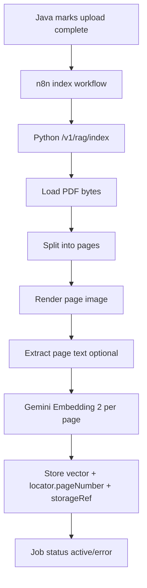

## PDF Indexing Flow

### Entscheidungslogik

- Eine Seite entspricht einer Evidence-Einheit (`pdf_page`).
- Beim Answering sieht Flash die Top-Seiten als Bild/PDF (nicht nur Textchunk).
- Nachbarseiten können bei Bedarf (`p-1`, `p`, `p+1`) ergänzt werden.
