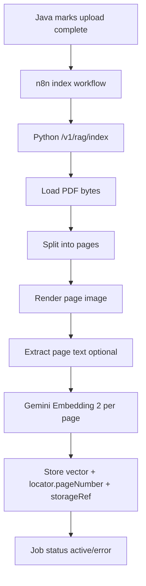

## Flow: PDF Indexing

Dieses Dokument beschreibt die PDF-Ingestion von “Upload fertig” bis “retrievalfähig”.

---

## Kurzüberblick

- Java markiert Dokument als `uploaded`.
- n8n startet den Python-Index-Job.
- Python zerlegt PDF seitenweise, erzeugt pro Seite Embedding und speichert Evidence.
- Jede Seite wird als `pdf_page` mit `locator.pageNumber` gespeichert.

---

## 1. Detaillierter Ablauf

1) Upload wurde in Java abgeschlossen (`complete-upload`).
2) Java/n8n triggert `POST /v1/rag/index` mit:
   - `coachProfileId`
   - `sourceKind=document`
   - `sourceId=documentId`
   - `contentBase64` (oder später Storage-Referenz)
3) Python erkennt `content_type=pdf`.
4) PDF wird in einzelne Seiten überführt.
5) Pro Seite:
   - Seitenbild (PNG) rendern
   - optional Text extrahieren (`extractedText`)
   - Seite mit Gemini Embedding 2 embeddeden
   - Row in Supabase schreiben mit:
     - `embedding`
     - `metadata.evidence_type=pdf_page`
     - `metadata.locator.pageNumber`
     - `metadata.storage_refs`
     - optional `text_content=extractedText`
6) Job endet in `active` (oder `error` mit Fehlertext).

---

## 2. Ablaufdiagramm

---

## 3. Answering-Bezug (wichtig für Wartung)

- Retrieval nutzt Embeddings + ggf. extractedText.
- In der Antwortphase sieht Flash die **Top-Seiten wirklich visuell** (Layout/Tabellen/Diagramme).
- Nachbarseiten (`p-1`, `p+1`) werden nur bei Bedarf ergänzt, um Kosten zu kontrollieren.

---

## 4. Fehlerfälle

- PDF kann nicht gelesen werden: Job auf `error`, Hinweis in Job-Status.
- Embedding einzelner Seite scheitert: Seite überspringen oder Job failen (Policy festlegen); aktuell fail-fast.
- Fehlende Storage-Refs: Fallback-Ref `inline` wird gesetzt, damit Retrieval nicht bricht.

---

## Relevante Dateien

| Bereich | Datei |
|---|---|
| Processing | `services/rag_service/src/rag_service/processors.py` |
| Indexing orchestration | `services/rag_service/src/rag_service/service.py` |
| API entry | `services/rag_service/src/rag_service/main.py` |
