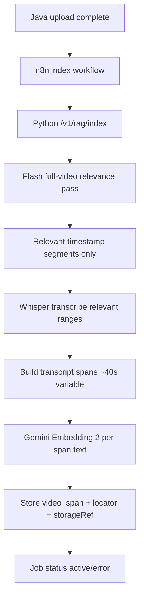

## Flow: Video Indexing

Dieses Dokument beschreibt den Video-Ingestion-Flow inklusive Relevanzlogik und Transcript-first Indexing.

---

## Kurzüberblick

- Video wird nicht blind als Ganzes eingebettet.
- Erst Segmentlogik (Flash best-effort oder Fallback), danach Whisper-Transkription.
- Nur relevante Zeitbereiche werden transkribiert, danach als Text-Spans indexiert.

---

## 1. Detaillierter Ablauf

1) Java markiert Video als `uploaded`.
2) n8n startet `POST /v1/rag/index` im Python-Service (Payload mit `contentBase64`, `contentUrl` oder bei konfiguriertem Worker **`contentBucket` + `contentKey`** → Python lädt Original per S3-Worker, siehe `content_loader.py`).
3) Python erkennt `content_type=video`.
4) Full-pass Segmentierung (Primärpfad):
   - Flash sieht das gesamte Video und liefert `startSec/endSec/label/summary/tags`.
5) Relevanz-/Labeling-Pass (Primärpfad):
   - Relevante Segmente werden als Time-Ranges genutzt (`noise` wird verworfen).
6) Fallback-Pfad:
   - Wenn Full-Pass fehlschlägt, nutzt der Service Window-basierte Flash-Analyse oder deterministische Fallback-Segmente.
7) Whisper transkribiert bevorzugt nur relevante Ranges (sonst gesamtes Video):
   - Modell: `whisper-1`
   - Sprache: default `de` (konfigurierbar)
   - Timestamps: Segment-Level
8) Aus Transkriptsegmenten werden RAG-Spans gebaut:
   - Ziel ~40s, variabel, max ~60s
   - `startSec/endSec` bleiben absolut im Originalvideo
9) Für jeden Span:
   - Text-Embedding mit Gemini Embedding 2
   - Speicherung als `evidence_type=video_span` inkl. Locator/StorageRef
10) Jobstatus aktualisieren (`active`/`error`).

---

## 2. Ablaufdiagramm

---

## 3. Antwortphase-Bezug

- Retrieval liefert Top Evidences mit Zeitfenstern.
- In der Chatphase bekommt Flash diese Zeitstempel plus URL (aus Java Resolve).
- Ziel: präzise Zitate mit `mm:ss`.

---

## 4. Wichtige Wartungshinweise

- Summary/Tags pro Segment (nicht pro Window) sind der Haupthebel für Kosten.
- Span-Größe (target/max) beeinflusst Qualität, Recall und Kosten direkt.
- Bei hohen Datenmengen zuerst Segment-Filter schärfen, bevor an Embedding/DB skaliert wird.
- Full-pass Fehlertoleranz ist Pflicht: Segment-Fallback darf Indexing nie komplett blockieren.

---

## Relevante Dateien

| Bereich | Datei |
|---|---|
| Video processing + span building | `services/rag_service/src/rag_service/processors.py` |
| Segment analysis | `services/rag_service/src/rag_service/video_analysis.py` |
| Whisper transcription | `services/rag_service/src/rag_service/transcription.py` |
| Content load (Base64 / URL / S3 worker) | `services/rag_service/src/rag_service/content_loader.py` |
| S3 worker | `services/rag_service/src/rag_service/object_storage.py` |
| Index orchestration | `services/rag_service/src/rag_service/service.py` |
