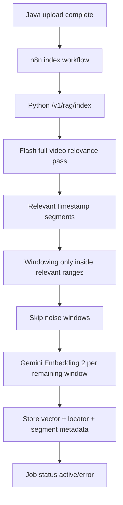

## Flow: Video Indexing

Dieses Dokument beschreibt den Video-Ingestion-Flow inklusive Relevanzlogik, Segment-Metadaten und Window-Embeddings.

---

## Kurzüberblick

- Video wird nicht blind als Ganzes eingebettet.
- Erst Segmentlogik (Flash best-effort oder Fallback), danach Window-Embedding.
- Nur relevante Fenster sollen langfristig in den Index.

---

## 1. Detaillierter Ablauf

1) Java markiert Video als `uploaded`.
2) n8n startet `POST /v1/rag/index` im Python-Service.
3) Python erkennt `content_type=video`.
4) Video wird in Windows geschnitten:
   - Dieser Schritt erfolgt **nach** der Segmentbestimmung nur innerhalb relevanter Zeitbereiche.
5) Relevanz-/Labeling-Pass (Primärpfad):
   - Flash sieht das **gesamte Video** und liefert Segmentliste mit `startSec/endSec/label/summary/tags`.
6) Fallback-Pfad:
   - Wenn Full-Pass fehlschlägt, nutzt der Service Window-basierten Fallback (oder deterministische Segmentierung).
7) Für Fenster mit Label `noise` wird Embedding übersprungen (Qualitäts- und Kostenkontrolle).
8) Für übrige Fenster:
   - Embedding erstellen
   - Evidence speichern mit:
     - `evidence_type=video_window`
     - `locator.startSec/endSec/paddingSec`
     - `segment_id`, `segment_summary`, `labels`
9) Jobstatus aktualisieren (`active`/`error`).

---

## 2. Ablaufdiagramm

---

## 3. Antwortphase-Bezug

- Retrieval liefert Top Evidences mit Zeitfenstern.
- In der Chatphase bekommt Flash diese Zeitfenster plus URL (aus Java Resolve).
- Ziel: präzise Zitate mit `mm:ss`.

---

## 4. Wichtige Wartungshinweise

- Summary/Tags pro Segment (nicht pro Window) sind der Haupthebel für Kosten.
- Fenstergröße und Overlap beeinflussen sowohl Qualität als auch Vektoranzahl massiv.
- Bei hohen Datenmengen zuerst Segment-Filter schärfen, bevor an Embedding/DB skaliert wird.
- Full-pass Fehlertoleranz ist Pflicht: Segment-Fallback darf Indexing nie komplett blockieren.

---

## Relevante Dateien

| Bereich | Datei |
|---|---|
| Video splitting | `services/rag_service/src/rag_service/processors.py` |
| Segment analysis | `services/rag_service/src/rag_service/video_analysis.py` |
| Index orchestration | `services/rag_service/src/rag_service/service.py` |
