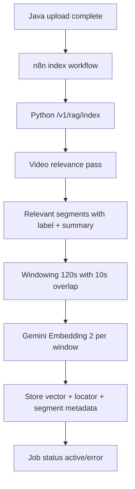

## Video Indexing Flow

### Aktueller technischer Stand

- Windowing ist implementiert (120s/10s).
- Segment-Metadaten sind als Struktur vorgesehen.
- Der produktive Flash-Relevanzpass ist noch als nächster Ausbauschritt offen; aktuell sichere Fallback-Segmentierung.

### Qualitäts-/Kostenregel

- Keine Summary pro Window.
- Summary/Tags pro Segment reichen für Hybrid-Filter und Explainability.
