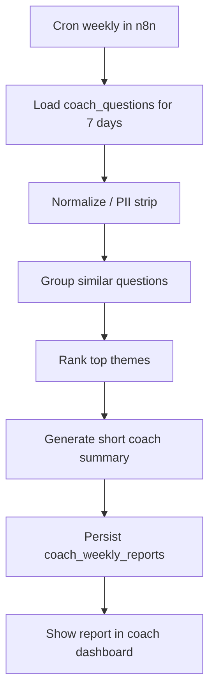

## Flow: Weekly Report (Coach Insights)

Dieses Dokument beschreibt den geplanten Reporting-Flow für “häufigste Fragen / Unklarheiten”.

---

## Kurzüberblick

- Ziel: Coaches sollen ohne Rohchat-Analyse sehen, welche Themen häufig unklar sind.
- Trigger: 1x pro Woche per n8n Cron.
- Ergebnis: kompakter Report mit Top-Themen, Beispielen, Trends, Content-Gaps.

---

## 1. Detaillierter Ablauf

1) n8n Cron startet wöchentlich.
2) Für jeden Coach werden Fragen der letzten 7 Tage geladen (`coach_questions`).
3) Daten werden normalisiert:
   - PII strip (falls nötig)
   - Duplicate-/Variantennormalisierung
4) Fragen werden thematisch gruppiert (LLM grouping oder Embedding+Clustering).
5) Pro Thema werden Kennzahlen gebildet:
   - Häufigkeit
   - Veränderung zur Vorwoche
   - optional negative Feedback-Rate / “no evidence” Rate
6) LLM erstellt kurze coach-lesbare Zusammenfassung.
7) Report wird in `coach_weekly_reports` gespeichert.
8) Frontend/Coach-Dashboard zeigt den Report.

---

## 2. Ablaufdiagramm

---

## 3. Warum dieser Flow wartbar ist

- Reporting ist entkoppelt vom Live-Chat.
- Frage-Logging ist minimal und retentionfähig.
- Cluster-/Summary-Strategie kann später verbessert werden, ohne Chat-Flow umzubauen.

---

## 4. Output-Format (MVP)

- Top Themen der Woche
- Paraphrasierte Beispielfragen (kein unnötiges Vollzitat)
- Trend zur Vorwoche
- Content-Gaps (häufige Fragen mit schwacher Evidenz/Feedback)
