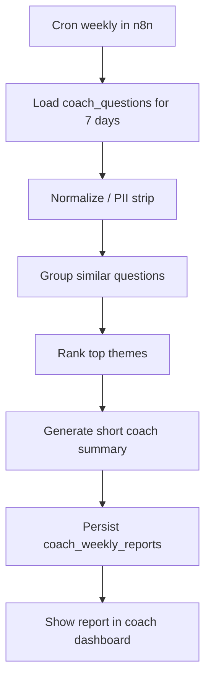

## Weekly Report Flow (Coach Insights)

```mermaid
flowchart TD
  A[Cron weekly in n8n] --> B[Load coach_questions for 7 days]
  B --> C[Normalize / PII strip]
  C --> D[Group similar questions]
  D --> E[Rank top themes]
  E --> F[Generate short coach summary]
  F --> G[Persist coach_weekly_reports]
  G --> H[Show report in coach dashboard]
```

### Output

- Top Themen der Woche
- Paraphrasierte Beispielfragen
- Trend zur Vorwoche
- Content-Gaps (häufige Fragen mit schwacher Evidenz/Feedback)
