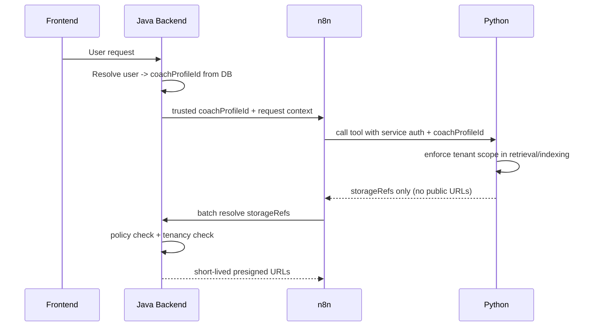

## Flow: Security and Tenancy

Dieses Dokument beschreibt, wie Tenancy und Zugriffssicherheit im Zielsystem durchgesetzt werden.

---

## Kurzüberblick

- Tenancy-Quelle ist Java (DB/Session), nicht der Client.
- n8n und Python arbeiten nur mit trusted Kontext.
- Presigned URLs werden ausschließlich im Java-Backend erzeugt.

---

## 1. Detaillierter Ablauf

1) Frontend sendet User-Request an Java.
2) Java bestimmt `coachProfileId` aus verifizierter User-Identität.
3) Java startet n8n-Workflow mit trusted Kontext.
4) n8n ruft Python mit service-auth auf.
5) Python erzwingt tenant-scope beim Retrieval/Indexing.
6) Python liefert nur `storageRefs`.
7) n8n ruft Java Resolve-Batch auf.
8) Java prüft pro Ref Ownership/Policy und gibt kurzlebige URLs zurück.

---

## 2. Ablaufdiagramm

---

## 3. Sicherheitsprinzipien (konkret)

- `coachProfileId` niemals aus Usertext übernehmen.
- Service-to-service Auth via Bearer Secret (MVP), später HMAC/mTLS/JWT.
- Presigned URLs ausschließlich serverseitig (Java) erzeugen.
- URLs kurz halten (Standard 300s), keine persistente Speicherung in Chat-Memory.

---

## 4. Häufige Fehlerbilder

- Tenant-Leak durch fehlenden Filter in Python-Query.
- Aufgelöste URL wird im falschen Kontext wiederverwendet.
- n8n-Workflow nutzt untrusted ID aus Payload statt Java-Kontext.

Gegenmaßnahmen: strikte Validatoren, tenant assertions im Service, Batch-Resolve über Java.
