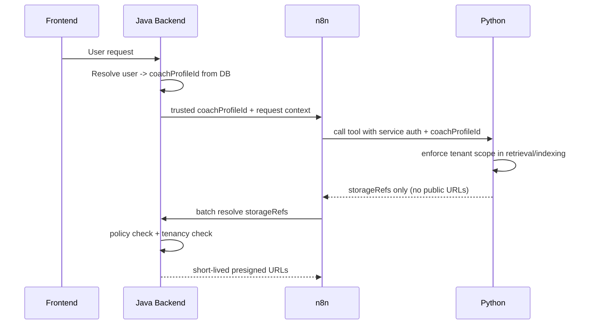

## Flow: Security and Tenancy

Dieses Dokument beschreibt, wie Tenancy und Zugriffssicherheit im Zielsystem durchgesetzt werden.

---

## Kurzüberblick

- Tenancy-Quelle ist Java (DB/Session), nicht der Client.
- n8n und Python arbeiten nur mit trusted Kontext.
- **Für Chat/Answering (Flash, Medien):** Kurzlebige **Presigned-URLs** werden im **Java-Backend** erzeugt (Batch-Resolve auf `storageRefs`).
- **Für Indexing (Worker):** Der Python-Service kann **zusätzlich** mit **eigenen Worker-Credentials** (`RAG_S3_*`, boto3) auf S3 zugreifen: Originale laden (`GET`) und z. B. PDF-Seitenbilder als Derivate speichern (`PUT`). Das ist ein **separater Pfad** (Service-zu-Storage), nicht die gleiche URL-Politik wie beim Nutzer-Chat.
- Python liefert nach außen (Retrieve-API) weiterhin nur **Storage-Referenzen** und Locator-Metadaten, keine dauerhaften öffentlichen Links.

---

## 1. Detaillierter Ablauf

### A) Chat-Answering (Evidence an Flash)

1) Frontend sendet User-Request an Java.
2) Java bestimmt `coachProfileId` aus verifizierter User-Identität.
3) Java startet n8n-Workflow mit trusted Kontext.
4) n8n ruft Python mit service-auth auf.
5) Python erzwingt tenant-scope beim Retrieval/Indexing.
6) Python liefert nur `storageRefs`.
7) n8n ruft Java Resolve-Batch auf.
8) Java prüft pro Ref Ownership/Policy und gibt kurzlebige URLs zurück.

### B) Indexing-Job (Medienbytes laden / Derivate schreiben)

1) Java oder n8n ruft Python `POST /v1/rag/index` mit vertrauenswürdigem Kontext auf.
2) Payload enthält **entweder** `contentBase64` / `contentUrl` (presigned) **oder** bei aktiviertem Worker: `contentBucket` + `contentKey` (Referenz auf Objekt in S3).
3) Python lädt Bytes **über Worker-Object-Storage** (`content_loader.py`), falls `RAG_S3_*` gesetzt; optional Upload von PDF-Seitenbildern unter `{contentKey}/pages/{n}.…`.
4) Tenant-Scope und Key-Allowlists (`RAG_S3_ALLOWED_BUCKETS`, `RAG_S3_KEY_PREFIX_ALLOWLIST`) begrenzen den Zugriff.

---

## 2. Ablaufdiagramm

*(Separater Indexing-Pfad: `P` kann bei konfiguriertem Worker direkt mit S3 für GET/PUT interagieren – nicht im Diagramm enthalten, um Chat-Flow lesbar zu halten.)*

---

## 3. Sicherheitsprinzipien (konkret)

- `coachProfileId` niemals aus Usertext übernehmen.
- Service-to-service Auth via Bearer Secret (MVP), später HMAC/mTLS/JWT.
- **Chat**: Presigned URLs für Endnutzer-Medien nur über Java (kurze TTL).
- **Indexing-Worker**: Eigene Credentials, strikte Bucket-/Prefix-Allowlists; keine Vermischung mit Client-Presign-Logik.
- URLs kurz halten (Standard 300s), keine persistente Speicherung in Chat-Memory.
- Tenant-Filter sowohl in Retrieval-RPC als auch bei Nachfilterung erzwingen.

---

## 4. Häufige Fehlerbilder

- Tenant-Leak durch fehlenden Filter in Python-Query.
- Aufgelöste URL wird im falschen Kontext wiederverwendet.
- n8n-Workflow nutzt untrusted ID aus Payload statt Java-Kontext.

Gegenmaßnahmen: strikte Validatoren, tenant assertions im Service, Batch-Resolve über Java.
