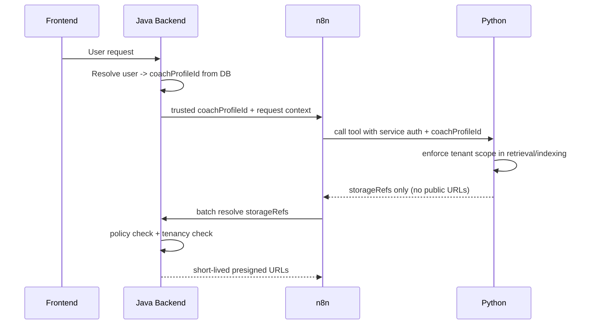

## Security and Tenancy Flow

### Sicherheitsprinzipien

- `coachProfileId` niemals aus Usertext übernehmen.
- Service-to-service Auth via Bearer Secret (MVP), später HMAC/mTLS/JWT.
- Presigned URLs ausschließlich serverseitig (Java) erzeugen.
